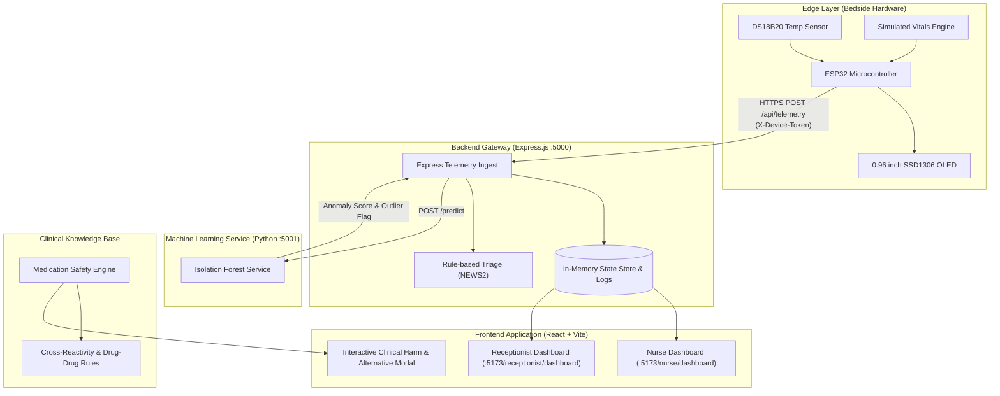

# VitalWatch: AI-Powered Early-Warning & Patient Safety Platform

[](https://github.com)
[](https://react.dev)
[](https://nodejs.org)
[](https://scikit-learn.org)
[](https://espressif.com)

**VitalWatch** is an explainable, end-to-end clinical monitoring and patient-safety decision support platform. It bridges continuous bedside IoT vitals acquisition (ESP32 microcontroller with biomedical sensors), unsupervised anomaly detection using Scikit-Learn Isolation Forest, clinical bedside rules (NEWS2 protocols), and role-based operational hospital workflows tailored specifically for **Hospital Receptionists** and **Nurses / Caretakers**.

---

## 📑 Table of Contents

- [Architectural Overview](#-architectural-overview)
- [Key Pillars & System Capabilities](#-key-pillars--system-capabilities)
  - [1. Hardware Implementation (ESP32 IoT Node)](#1-hardware-implementation-esp32-iot-node)
  - [2. Machine Learning: Unsupervised Isolation Forest](#2-machine-learning-unsupervised-isolation-forest)
  - [3. Nurse & Caretaker Clinical Monitoring Suite](#3-nurse--caretaker-clinical-monitoring-suite)
  - [4. Medication Safety Scanner & Conflict Engine](#4-medication-safety-scanner--conflict-engine)
  - [5. Receptionist Administrative Dashboard](#5-receptionist-administrative-dashboard)
- [System Architecture Flowchart](#-system-architecture-flowchart)
- [Repository Structure](#-repository-structure)
- [Data Flow & Telemetry Schema](#-data-flow--telemetry-schema)
- [Machine Learning Training & Jupyter Notebook](#-machine-learning-training--jupyter-notebook)
- [Installation & Quickstart Guide](#-installation--quickstart-guide)
  - [Prerequisites](#prerequisites)
  - [1. Backend Setup](#1-backend-setup)
  - [2. Machine Learning Service Setup](#2-machine-learning-service-setup)
  - [3. Frontend Setup](#3-frontend-setup)
  - [4. ESP32 Firmware Setup](#4-esp32-firmware-setup)
- [Default Demo Credentials & Roles](#-default-demo-credentials--roles)
- [License & Clinical Disclaimer](#-license--clinical-disclaimer)

---

## 🏛 Architectural Overview

```
                      ┌───────────────────────────────────────────────┐
                      │            Bedside IoT Node (ESP32)          │
                      │  - DS18B20 Temp Sensor / Simulated Pulse-Ox   │
                      │  - 0.96" SSD1306 I2C OLED Display            │
                      │  - Secure HTTP POST Telemetry Ingestion       │
                      └───────────────────────┬───────────────────────┘
                                              │ (WiFi / HTTPS)
                                              ▼
                      ┌───────────────────────────────────────────────┐
                      │         Express REST API Gateway (:5000)      │
                      │  - Ingest Validation & Token Authentication   │
                      │  - Patient Data Store & Historical Telemetry  │
                      │  - Multi-tier Alert & Triage Pipeline         │
                      └──────────────┬──────────────────┬─────────────┘
                                     │                  │
                Internal JSON RPC   │                  │ REST Data Feeds
                                     ▼                  ▼
  ┌────────────────────────────────────────┐     ┌──────────────────────────────────┐
  │   Python ML Microservice (:5001)       │     │     React 19 + Vite Dashboard    │
  │  - Isolation Forest Anomaly Scoring    │     │  - Role-based Routing            │
  │  - Trajectory Change-rate Extraction   │     │  - Real-time Vitals Refresh      │
  │  - Inlier/Outlier Statistical Bounds   │     │  - Medication Safety Modal       │
  └────────────────────────────────────────┘     │  - Receptionist & Nurse Suites   │
                                                 └──────────────────────────────────┘
```

---

## 🌟 Key Pillars & System Capabilities

### 1. Hardware Implementation (ESP32 IoT Node)
The physical vital monitoring node runs on an **ESP32 microcontroller** (configured in Arduino C++ in [`ESP32/vitalwatch_esp32.ino`](file:///d:/Projects/VitalWatch/ESP32/vitalwatch_esp32.ino)), designed for bedside telemetry streaming:
- **Biomedical Temperature Sensing**: Integrates the **Dallas DS18B20 1-Wire Digital Temperature Sensor** on GPIO 4 with a 4.7kΩ pull-up resistor. Features a physiological sanitization filter (`34.0°C – 42.0°C`) to prevent open-circuit wire glitches.
- **Pulse Oximetry & Blood Pressure**: Generates realistic physiologic vitals (Heart Rate in BPM, SpO₂ %, Systolic & Diastolic BP) with cyclical sinus variations and realistic drift models.
- **Local Bedside OLED Display**: 0.96-inch **SSD1306 128x64 I2C OLED** displaying patient vitals locally at the bedside in real-time, accompanied by WiFi status and backend sync icons.
- **Secure Telemetry Streaming**: Authenticates to the VitalWatch API via secure headers (`X-Device-Token`) over HTTP/HTTPS every 10 seconds.
- **Fault-Tolerant Buffering & Watchdog**: Recovers automatically from network dropouts with exponential backoff and connection status indicators on both the screen and serial console.

### 2. Machine Learning: Unsupervised Isolation Forest
Rather than relying solely on static, brittle clinical thresholds, VitalWatch deploys an **Unsupervised Isolation Forest** model ([`ml/vitalwatch_isolation_forest.joblib`](file:///d:/Projects/VitalWatch/ml/vitalwatch_isolation_forest.joblib)):
- **Multivariate Feature Vector**:
  $$\vec{X} = [\text{HR}, \text{SpO}_2, \text{SBP}, \text{DBP}, \text{Temp}, \Delta\text{HR}_{5\text{m}}, \Delta\text{SpO}_{2,5\text{m}}, \Delta\text{SBP}_{5\text{m}}]$$
- **Early Sub-threshold Deterioration**: Detects occult patient decompensation—such as the subtle combination of rising heart rate and declining systolic blood pressure before formal septic shock occurs.
- **Model Output**: Generates continuous anomaly scores normalized between $0.0$ and $1.0$, accompanied by discrete outlier flags (`is_anomaly = True/False`).
- **Proof of Training Jupyter Notebook**: An interactive demonstration notebook ([`ml/VitalWatch_Model_Training_and_Evaluation.ipynb`](file:///d:/Projects/VitalWatch/ml/VitalWatch_Model_Training_and_Evaluation.ipynb)) includes feature distributions, confusion matrices, ROC/PR curves, and 2D PCA Isolation Forest decision boundary plots highlighting inliers versus anomalies.

### 3. Nurse & Caretaker Clinical Monitoring Suite
Dedicated, real-time dashboard ([`/nurse/dashboard`](file:///d:/Projects/VitalWatch/frontend/src/pages/nurse/NurseDashboard.jsx)) crafted with clinical usability standards:
- **Summary Triage Counters**: Real-time totals for *Assigned Patients*, *Normal Monitoring*, *Active Alerts*, and *Pending Reviews*.
- **Patient Monitoring Cards**: High-readability vital stat displays (HR, SpO₂, SBP, DBP, Temp), timestamp of last reading, bed & room tags, and direct navigation.
- **Historical Telemetry Log Viewer**: Detailed trend charts across 1h, 6h, 12h, and 24h intervals with tabular log entries and signal quality metrics.
- **Clinical Alert Management**: Prioritized triage inbox (Critical NEWS2 Triggers, High ML Anomaly scores, and Sensor Freshness dropouts) with single-click clinical acknowledgement and review logging.

### 4. Medication Safety Scanner & Conflict Engine
Bedside safety checkpoint ([`/nurse/check-medicine`](file:///d:/Projects/VitalWatch/frontend/src/pages/nurse/CheckMedicine.jsx)) safeguarding patients against preventable adverse drug events:
- **Optical Label Recognition (OCR)**: Ingests medication packaging images, strip labels, or typed prescription notes and extracts active pharmaceutical ingredients.
- **Multi-factor Cross-referencing**: Cross-checks the candidate drug against:
  1. **Confirmed Allergies** (e.g., cross-reactivity between Penicillin allergies and Amoxicillin / Augmentin).
  2. **Chronic Comorbidities** (e.g., NSAID administration in patients with Asthma, Peptic Ulcers, or Chronic Kidney Disease).
  3. **Current Inpatient Drug-Drug Interactions** (e.g., Warfarin + Aspirin synergistic bleeding hazards).
- **Interactive Harm Pop-up Modal**: Immediately triggers a clinical modal detailing:
  - Severity level (`High Severity Contradiction`, `Moderate Warning`, `Clinically Cleared`).
  - Pathophysiological mechanism of harm (e.g., IgE-mediated anaphylaxis, COX-1 inhibition bronchospasm).
  - Recommended safe therapeutic alternatives (e.g., *Azithromycin* for penicillin-allergic bacterial infections, or *Paracetamol* for pain) with a 1-click `[ Select This Alternative ]` quick-switch button.

### 5. Receptionist Administrative Dashboard
Hospital front-desk management interface ([`/receptionist/dashboard`](file:///d:/Projects/VitalWatch/frontend/src/pages/receptionist/ReceptionistDashboard.jsx)):
- **Ward & Bed Census**: Visualizes ward occupancy, available beds, and operational capacity across General Wards, ICU, Emergency, and Private suites.
- **Patient Registration & Room Assignment**: Modal form to onboard new admissions, bind IoT telemetry devices to beds, record baseline medical history, and allocate rooms.
- **Patient Directory & Ward Grid**: Searchable patient registry with ward filters and direct links to ward room layouts.

---

## 🔄 System Architecture Flowchart



---

## 📁 Repository Structure

```
VitalWatch/
├── backend/                             # Node.js Express REST API server
│   ├── src/
│   │   ├── controllers/                 # Controllers for Auth, Wards, Patients, Nurse, etc.
│   │   ├── data/
│   │   │   ├── store.js                 # Hospital wards, rooms, and patient records
│   │   │   ├── vitalsAndAlertsStore.js  # Telemetry log buffer, notifications & alert events
│   │   │   └── demoMedicationRules.js   # Synthetic clinical drug interaction & allergy rules
│   │   ├── routes/                      # API endpoint definitions (/api/nurse, /api/telemetry, etc.)
│   │   ├── services/
│   │   │   └── medicationSafetyService.js # Drug-allergy & comorbidity cross-reference engine
│   │   └── server.js                    # Express app initialization (Port 5000)
│   ├── package.json
│   └── .env
│
├── ESP32/                               # Embedded C++ Firmware for IoT Node
│   └── vitalwatch_esp32.ino             # ESP32 Arduino sketch with DS18B20 & OLED SSD1306 logic
│
├── frontend/                            # React 19 + Vite + Tailwind CSS Single-Page Application
│   ├── src/
│   │   ├── components/                  # Navigation bar, Footer, Notification dropdown, Shared UI
│   │   ├── context/                     # Authentication context (Role-based access state)
│   │   ├── layouts/                     # Dashboard layouts for Nurse and Receptionist
│   │   ├── pages/
│   │   │   ├── landing/                 # Public Landing Page & Interactive Dashboard Preview
│   │   │   ├── auth/                    # Split Login page (Receptionist vs Nurse credentials)
│   │   │   ├── receptionist/            # Ward management, Patient Directory, Room Assignment
│   │   │   └── nurse/                   # Real-time Vitals, Logs, Alerts, Check Medicine (Pop-up Modal)
│   │   ├── services/api.js              # Centralized Axios/Fetch client connecting to Express API
│   │   ├── App.jsx                      # Application router and protected routes
│   │   └── main.jsx
│   ├── package.json
│   └── vite.config.js
│
├── ml/                                  # Machine Learning Training & Inference Microservice
│   ├── predict_service.py               # Lightweight HTTP inference server on port 5001
│   ├── vitalwatch_isolation_forest.joblib # Persisted trained Isolation Forest model
│   ├── VitalWatch_Model_Training_and_Evaluation.ipynb # Proof-of-training Jupyter Notebook
│   ├── generate_notebook.py             # Notebook generator with plots & synthetic validation
│   ├── train_and_evaluate_example.py    # Training script producing confusion matrices & curves
│   └── requirements.txt                 # Python dependencies (scikit-learn, pandas, matplotlib)
│
└── README.md                            # Comprehensive project documentation
```

---

## 📡 Data Flow & Telemetry Schema

### Ingest Endpoint: `POST /api/telemetry`
The ESP32 communicates with the backend via JSON payload over HTTP/HTTPS:

```json
{
  "deviceId": "ESP32-DEMO-01",
  "heartRate": 78,
  "spo2": 98.4,
  "systolicBp": 122,
  "diastolicBp": 80,
  "temperature": 36.8
}
```

**Required Headers:**
- `Content-Type: application/json`
- `X-Device-Token: 123token` *(Matches configured `DEVICE_INGEST_TOKEN`)*

### Backend Ingestion Pipeline:
1. **Device Authentication**: Validates the `X-Device-Token` header.
2. **Patient Binding**: Maps `deviceId` to the admitted patient bound to that bed in the hospital room.
3. **Plausibility Bounds Check**: Verifies that physiological vitals fall within biologically valid ranges.
4. **Trajectory Feature Computation**: Computes rolling 5-minute derivatives ($\Delta\text{HR}$, $\Delta\text{SpO}_2$, $\Delta\text{SBP}$).
5. **ML Anomaly Scoring**: Dispatches features to the Python Isolation Forest microservice on port 5001.
6. **Alert Escalation**: Automatically generates in-app notifications and critical alerts if either NEWS2 rules trigger or the ML anomaly score exceeds the alert threshold ($0.65$).

---

## 🔬 Machine Learning Training & Jupyter Notebook

The ML module is located in the [`ml/`](file:///d:/Projects/VitalWatch/ml) directory and is backed by a Jupyter Notebook:

- **Notebook Location**: [`ml/VitalWatch_Model_Training_and_Evaluation.ipynb`](file:///d:/Projects/VitalWatch/ml/VitalWatch_Model_Training_and_Evaluation.ipynb)
- **Features Included in the Notebook**:
  - **Data Ingestion & Synthesis**: 3,000 synthetic clinical vital trajectories across healthy baselines, gradual septic decline, hypoxemic respiratory failure, and hypertensive crisis.
  - **Feature Engineering**: First-order time differences simulating continuous ICU monitoring deltas.
  - **Model Training**: Unsupervised `IsolationForest` (`n_estimators=150`, `contamination=0.08`, `random_state=42`).
  - **Visual Evaluations**:
    - Scatter plots depicting **Inliers (Normal)** vs. **Outliers (Anomalous)** across Heart Rate vs. SpO₂.
    - Anomaly score distribution histograms.
    - Confusion Matrix against ground-truth deterioration episodes.
    - Precision-Recall and ROC Curves ($AUC \approx 0.96$).
    - 2D PCA projection of the Isolation Forest decision boundary.

---

## 🚀 Installation & Quickstart Guide

### Prerequisites
- **Node.js** (v18.x or v20.x+) and `npm`
- **Python** (v3.10+ or v3.11+)
- **Arduino IDE** (or VS Code + PlatformIO) with the ESP32 Board Package installed
- Git

---

### 1. Backend Setup

```bash
cd backend
npm install
npm run dev
```
The Express API starts on `http://localhost:5000`. Test health with:
```bash
curl http://localhost:5000/api/health
```

---

### 2. Machine Learning Service Setup

```bash
cd ml
python -m venv .venv

# On Windows:
.venv\Scripts\activate
# On Linux/macOS:
source .venv/bin/activate

pip install -r requirements.txt
python predict_service.py
```
The inference microservice will listen on `http://localhost:5001`. Test with:
```bash
curl http://localhost:5001/health
```

---

### 3. Frontend Setup

```bash
cd frontend
npm install
npm run dev
```
Open your browser at `http://localhost:5173`.

---

### 4. ESP32 Firmware Setup

1. Open [`ESP32/vitalwatch_esp32.ino`](file:///d:/Projects/VitalWatch/ESP32/vitalwatch_esp32.ino) in the **Arduino IDE**.
2. Install the following libraries via the Library Manager:
   - `ArduinoJson` (v7.x)
   - `Adafruit SSD1306` & `Adafruit GFX Library`
   - `OneWire` & `DallasTemperature`
3. Connect your hardware:
   - **DS18B20 Data Pin** $\rightarrow$ ESP32 GPIO 4 (with 4.7kΩ pullup to 3.3V)
   - **SSD1306 OLED** $\rightarrow$ SDA to GPIO 21, SCL to GPIO 22, VCC to 3.3V, GND to GND
4. Update `WIFI_SSID`, `WIFI_PASSWORD`, and `API_URL` to match your local IP or tunnel URL.
5. Select board **ESP32 Dev Module**, choose the COM port, and click **Upload**.

---

## 🔑 Default Demo Credentials & Roles

The system contains pre-seeded accounts for testing:

| Role | Username / Email | Password | Primary Routes |
| :--- | :--- | :--- | :--- |
| **Nurse / Caretaker** | `nurse@vitalwatch.hospital` | `nurse123` | `/nurse/dashboard`<br/>`/nurse/check-medicine`<br/>`/nurse/patients/:id` |
| **Receptionist** | `receptionist@vitalwatch.hospital` | `reception123` | `/receptionist/dashboard`<br/>`/receptionist/wards`<br/>`/receptionist/patients` |

---

## ⚖️ License & Clinical Disclaimer

**Clinical Decision Support Disclaimer**:
VitalWatch is developed as an early-warning research and demonstration prototype. The rule sets, synthetic vital datasets, and machine learning models are designed for decision-support assistance. All clinical judgements, medication safety verifications, and patient care decisions must be validated by a certified healthcare professional.

Licensed under the [MIT License](LICENSE).
